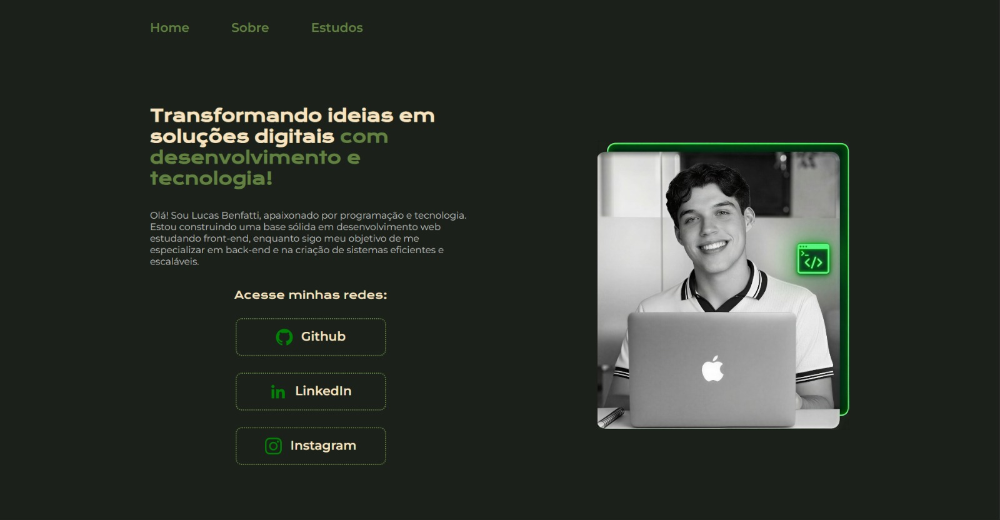
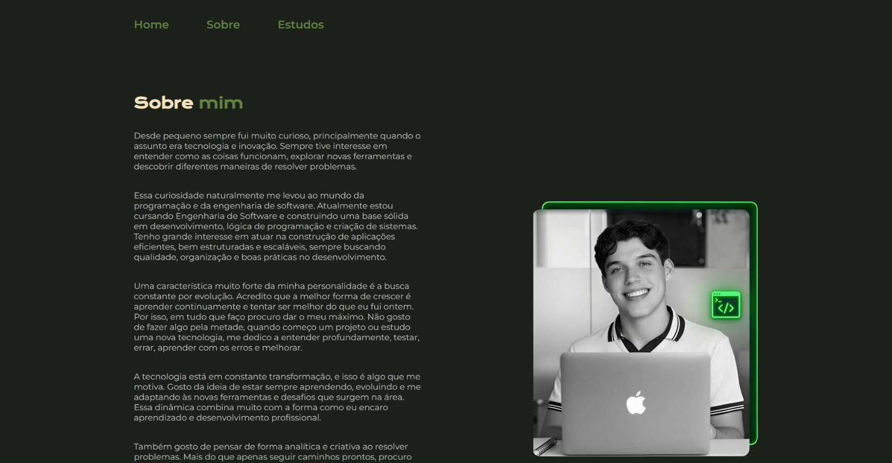
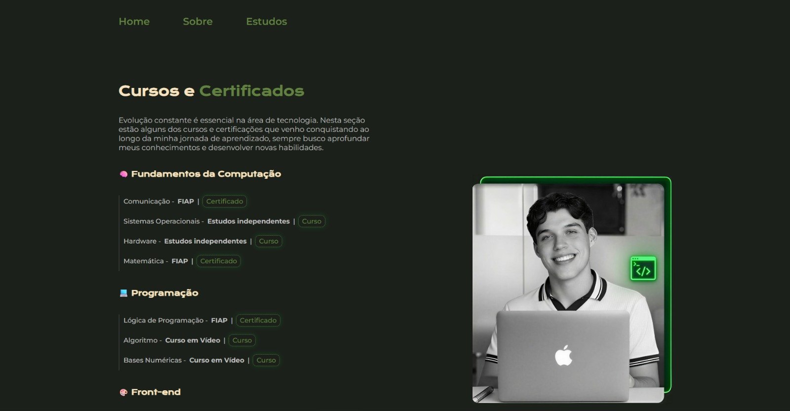

<h1 align="center">🌐 Personal Portfolio</h1>

  💻 Portfólio pessoal desenvolvido para apresentar cursos, habilidades e evolução como desenvolvedor  
  🚀 Focado em evolução

---

  

---

## 🚀 Sobre o projeto

Este projeto consiste no desenvolvimento do meu portfólio pessoal, criado com o objetivo de centralizar e apresentar meus projetos, habilidades técnicas e trajetória como desenvolvedor.

A aplicação foi construída com foco em simplicidade, organização e experiência do usuário, proporcionando uma navegação clara e objetiva.

---

## 🖥️ Tecnologias utilizadas

  

---

## 🎯 Funcionalidades

* 📄 Apresentação pessoal
* 📁 Exibição de projetos
* 📱 Layout responsivo
* 🎨 Interface limpa e organizada

---

## 🌐 Acesse o projeto

  

---

## 📸 Preview

    
    
  

---

## 💡 Aprendizados

* Criação de estrutura semântica para páginas web
* Desenvolvimento de layouts responsivos e adaptáveis
* Organização de seções para uma navegação clara
* Aplicação de estilização com CSS e variáveis de cores
* Planejamento e hierarquia visual de conteúdo

---

## 👨‍💻 Autor

  Lucas Benfatti  
  📍 Santos - SP

---

  🚀 Em constante evolução

